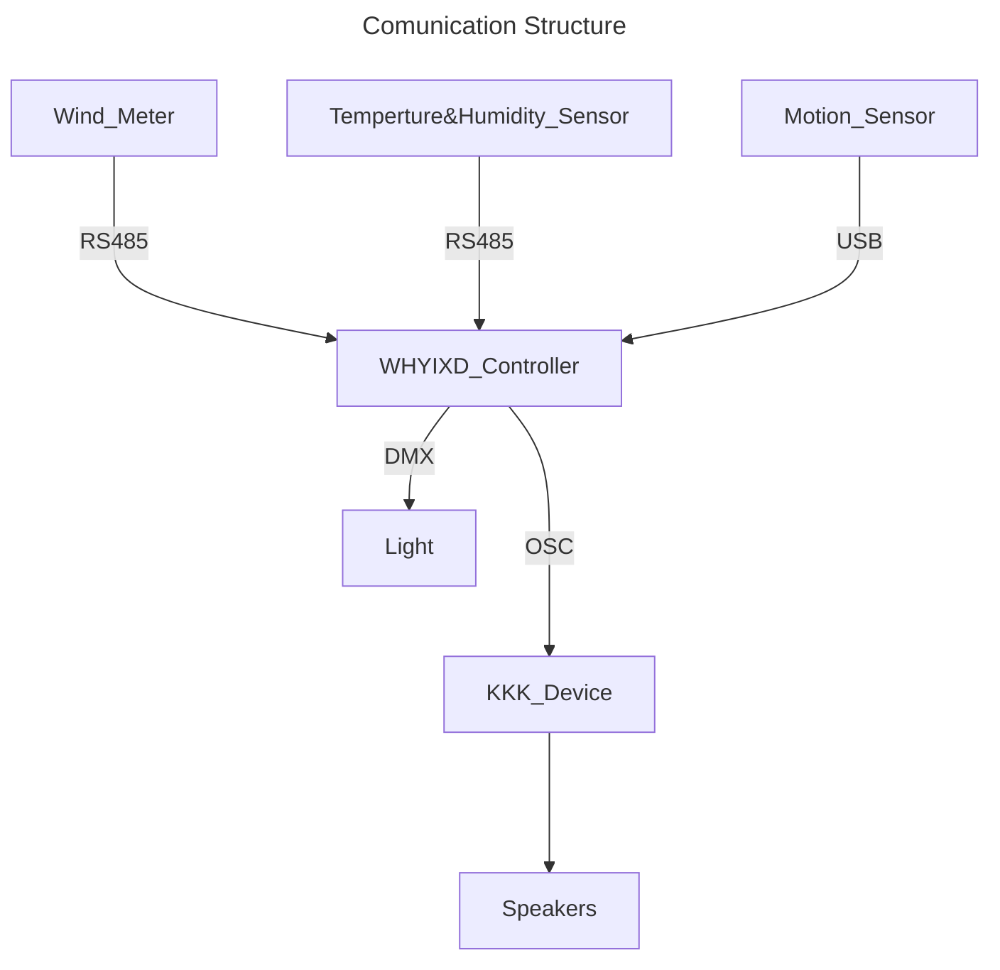

# Tender Soul of Ocean with KKK



## Data Packet

### OSC

**Address:** `/whyixd/wind/speed`  
**Data:** `float([wind speed])`

**Description:**  
Wind speed in m/s

example:

```osc
/whyixd/wind/speed 1.8
```

**Address:** `/whyixd/wind/speed_future`  
**Data:** `float([wind speed])`

**Description:**  
Predicted future wind speed in m/s

example:

```osc
/whyixd/wind/speed_future 3.6
```

---
**Address:** `/whyixd/wind/level`  
**Data:** `int([wind level])`

**Description:**  
Wind level in Beaufort scale

example:

```osc
/whyixd/wind/level 2
```

**Address:** `/whyixd/wind/level_future`  
**Data:** `int([wind level])`

**Description:**  
Predicted future wind level in Beaufort scale

example:

```osc
/whyixd/wind/level_future 4
```

---
**Address:** `/whyixd/wind/direction`  
**Data:** `int([wind direction])`

**Description:**  
Wind direction in angle 0-360

example:

```osc
/whyixd/wind/direction 90
```

**Address:** `/whyixd/wind/direction_future`  
**Data:** `int([wind direction])`

**Description:**  
Predicted future wind direction in angle 0-360

example:

```osc
/whyixd/wind/direction_future 270
```

---
**Address:** `/whyixd/temperature`  
**Data:** `float([temperature])`

**Description:**  
Temperature in °C

example:

```osc
/whyixd/temperature 23.5
```

---
**Address:** `/whyixd/humidity`  
**Data:** `float([humidity])`

**Description:**  
Relative humidity in %

example:

```osc
/whyixd/humidity 65.5
```

### If Motion Sensor is Infrared Camera

---
**Address:** `/whyixd/player/count`  
**Data:** `int([player count])`

**Description:**  
How many people been detected by camera

example:

```osc
/whyixd/player/count 5
```

---
**Address:** `/whyixd/player[index]`  
**Data:** `int([player state])`

**Description:**  
Return corresponding player is available

0 = not available

1 = available

example:

```osc
/whyixd/player2 0
```

---
**Address:** `/whyixd/player[index]/position`  
**Data:** `float([player position x]) float([player position y])`

**Description:**  
Return corresponding player position

example:

```osc
/whyixd/player2 -0.152 0.386
```
